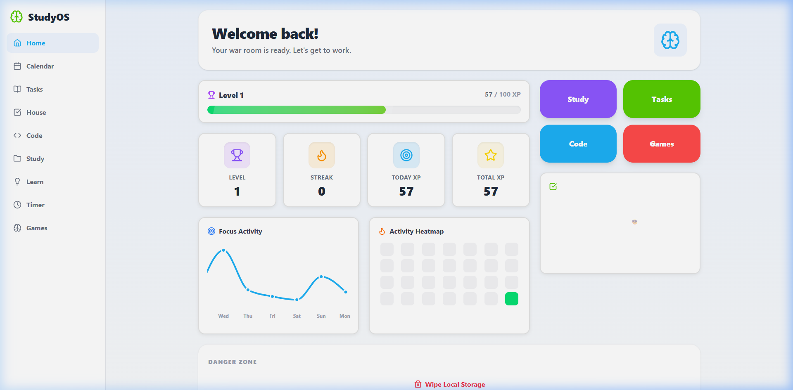
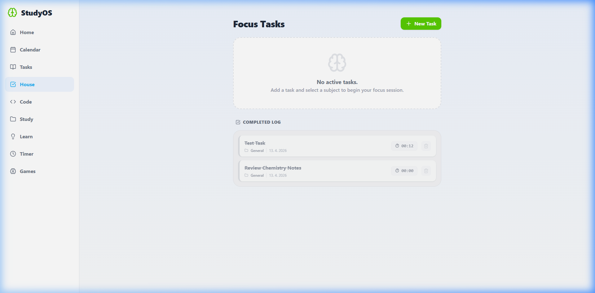

# 🧠 StudyOS - The Ultimate Student Command Center

StudyOS is a powerful, privacy-first productivity application designed for students and developers. It transforms your study sessions into a gamified experience with real-time tracking, subject-based organization, and deep focus metrics.

---

## 📸 Screenshots

### 📊 The War Room Dashboard


### 🗂 Categorized Task Tracking


---

## ✨ Key Features

- **🚀 Gamified Progression**: Earn XP for every task completed and level up your "War Room" profile.
- **📈 Activity Heatmap**: Visualize your consistency over the last 30 days with a GitHub-style activity contribution graph.
- **⏱ Active Focus Timer**: Track specific time spent on every task with a built-in play/pause timer.
- **📂 Multi-Dimensional Organization**: Group tasks by subject (e.g., Math, Coding, Science) for a cleaner workflow.
- **🔒 Privacy First**: 100% Local Storage based. No database, no tracking, just your data on your device.
- **📱 Responsive Design**: A high-end sidebar layout for Desktop and a persistent bottom-bar for Mobile.

## 🛠 Tech Stack

- **React + Vite**
- **Tailwind CSS** (Custom theme)
- **Framer Motion** (Smooth animations)
- **Lucide React** (Icons)
- **Recharts** (Data Visualization)

## 🚀 Getting Started

1. **Clone the repo**
   ```bash
   git clone https://github.com/nuffyofc/student-app.git
   ```

2. **Install dependencies**
   ```bash
   npm install
   ```

3. **Run the development server**
   ```bash
   npm run dev
   ```

4. **Access the app**
   Open `http://localhost:5173` in your browser. To access on your phone, use the Network IP provided in the terminal.

---

*Made with ❤️ for focused learners.*
